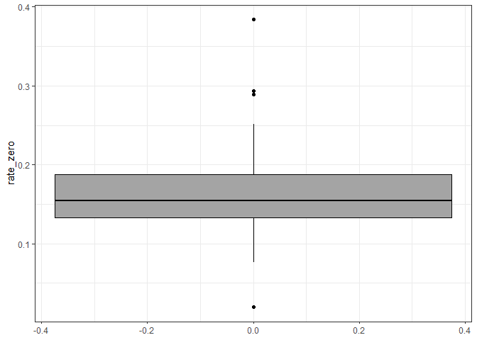

<script src="../../../site_libs/htmlwidgets-1.6.4/htmlwidgets.js"></script>
<link href="../../../site_libs/datatables-css-0.0.0/datatables-crosstalk.css" rel="stylesheet" />
<script src="../../../site_libs/datatables-binding-0.33/datatables.js"></script>
<script src="../../../site_libs/jquery-3.6.0/jquery-3.6.0.min.js"></script>
<link href="../../../site_libs/dt-core-1.13.6/css/jquery.dataTables.min.css" rel="stylesheet" />
<link href="../../../site_libs/dt-core-1.13.6/css/jquery.dataTables.extra.css" rel="stylesheet" />
<script src="../../../site_libs/dt-core-1.13.6/js/jquery.dataTables.min.js"></script>
<script src="../../../site_libs/jszip-1.13.6/jszip.min.js"></script>
<link href="../../../site_libs/dt-ext-buttons-1.13.6/css/buttons.dataTables.min.css" rel="stylesheet" />
<script src="../../../site_libs/dt-ext-buttons-1.13.6/js/dataTables.buttons.min.js"></script>
<script src="../../../site_libs/dt-ext-buttons-1.13.6/js/buttons.html5.min.js"></script>
<script src="../../../site_libs/dt-ext-buttons-1.13.6/js/buttons.colVis.min.js"></script>
<script src="../../../site_libs/dt-ext-buttons-1.13.6/js/buttons.print.min.js"></script>
<link href="../../../site_libs/crosstalk-1.2.1/css/crosstalk.min.css" rel="stylesheet" />
<script src="../../../site_libs/crosstalk-1.2.1/js/crosstalk.min.js"></script>

TODO: update the SQL query

``` r
source("R/table_with_options.R")
# very lazish function, col should be a string 
agg_count <- function(dat, col) {
    agg <- aggregate(cbind(count = dat$count),
                     list(name_col = dat[[col]]),
                      sum)
    colnames(agg) <- c(col, "count")
    return(agg)
}
```

The goals of this page is storing a quick EDA about broadband services
locations with 0 MBps uploads and 0 MBps downloads. To be concise we are
going to call them 0/0 speeds.

We have counted every services that have been declared with 0/0 speeds
and associated with their States, ISP and technology. To clarify that
does not mean a location have 0/0 speeds only but that one “ISP x
technology” is provided with this kind of service in this location.

The data used to provide most of the analysis was done with this 2 SQL
queries. They were saved and stored in `data/`

``` sql
SELECT 
    state_abbr,
    brand_name,
    technology,
    count(brand_name)
FROM
    staging.june23
WHERE
(max_advertised_download_speed = 0 AND
    max_advertised_upload_speed = 0) = true
GROUP BY brand_name, state_abbr, technology;

-- first get all 0/0 then get all the non 0/0

SELECT 
    state_abbr,
    brand_name,
    technology,
    count(brand_name)
FROM 
    staging.june23
WHERE
(max_advertised_download_speed = 0 AND
    max_advertised_upload_speed = 0) = false
GROUP BY brand_name, state_abbr, technology;
```

``` r
zero_loc <- read.csv("data/zero_dl_up.csv")
not_zero <- read.csv("data/not_zero_dl.csv")
```

## Summary by technologies:

``` r
agg <- agg_count(zero_loc, "technology") 
agg_not <- agg_count(not_zero, "technology")

technology <- merge(agg, agg_not, by.x = "technology", 
                    by.y = "technology", all.x = TRUE, all.y = TRUE) 
colnames(technology) <- c("technology",  "cnt_zero_dl", "cnt_non_zero")
technology$rate_zero <- round(technology$cnt_zero_dl / 
                (technology$cnt_zero_dl +  technology$cnt_non_zero), 4)

table_with_options(technology)
```

<div class="datatables html-widget html-fill-item" id="htmlwidget-d264b9f78abf0c6c7675" style="width:100%;height:auto;"></div>
<script type="application/json" data-for="htmlwidget-d264b9f78abf0c6c7675">{"x":{"filter":"none","vertical":false,"extensions":["Buttons"],"data":[[0,10,40,50,60,61,70,71,72],[29,17271298,24721,22942,36678,null,2201042,38540018,72535],[4060,40567062,102795944,62521744,339792513,114863490,45586988,95278280,8554415],[0.0071,0.2986,0.0002,0.0004,0.0001,null,0.0461,0.288,0.008399999999999999]],"container":"<table class=\"display\">\n  <thead>\n    <tr>\n      <th>technology<\/th>\n      <th>cnt_zero_dl<\/th>\n      <th>cnt_non_zero<\/th>\n      <th>rate_zero<\/th>\n    <\/tr>\n  <\/thead>\n<\/table>","options":{"dom":"Blfrtip","buttons":["copy","print",{"extend":"collection","buttons":["csv","excel"],"text":"Download"}],"columnDefs":[{"className":"dt-right","targets":[0,1,2,3]},{"name":"technology","targets":0},{"name":"cnt_zero_dl","targets":1},{"name":"cnt_non_zero","targets":2},{"name":"rate_zero","targets":3}],"order":[],"autoWidth":false,"orderClasses":false}},"evals":[],"jsHooks":[]}</script>

</br>

We do not mind too much `70` (Unlicensed Terrestrial Fixed Wireless)
because we are filtering it out but we are keeping `71` (Licensed
Terrestrial Fixed Wireless) , `72` (Licensed-by-Rule Terrestrial Fixed
Wireless)and `10` (Copper Wire).

To take that into account I will filter out Unlicensed Terrestrial Fixed
Wireless for the rest of this document. I also filtered out 60 and 61 to
be consistant with our pipelines.

## Summary by ISP

``` r
filter_sat <- c(60, 61, 70)
zero_loc <- zero_loc[which(! zero_loc$technology %in% filter_sat), ]
not_zero <- not_zero[which(! not_zero$technology %in% filter_sat), ]

agg <- agg_count(zero_loc, "brand_name")
agg_not <- agg_count(not_zero, "brand_name")

rate_zero <- merge(agg, agg_not, 
                   by.x = "brand_name", by.y = "brand_name"
                   , all.x = TRUE) 

colnames(rate_zero) <- c("brand_name", "cnt_zero_dl", "cnt_non_zero")
rate_zero$rate_zero <- round(rate_zero$cnt_zero_dl /
                 (rate_zero$cnt_zero_dl +  rate_zero$cnt_non_zero),
                            4)

table_with_options(rate_zero[
                    order(rate_zero$cnt_zero_dl, decreasing = TRUE),])
```

<div class="datatables html-widget html-fill-item" id="htmlwidget-9ed15d7534b4a6b3b083" style="width:100%;height:auto;"></div>
<script type="application/json" data-for="htmlwidget-9ed15d7534b4a6b3b083">{"x":{"filter":"none","vertical":false,"extensions":["Buttons"],"data":[["T-Mobile US","AT&amp;T Inc","Verizon","CenturyLink","Brightspeed","Consolidated Communications","Choice Wireless","Claro","Ziply Fiber","VTel Wireless, Inc.","Comcell","FRONTIER","Plateau Telecommunications Incorporated","Valor Telecommunications of Texas, LP","Rise Broadband","altafiber Extended Territories","ALASKA COMMUNICATIONS","Windstream Kentucky East, LLC","TDS Telecom","Pine Cellular Phones","West Central Wireless","Pioneer Telephone Cooperative, Inc.","Windstream Iowa Communications, Inc.","GVTC","Windstream Pennsylvania, LLC.","Windstream Georgia Communications, LLC","Hawaiian Telcom","FOCUS BROADBAND","altafiber Network Solutions","Acentek","Guadalupe Valley Electric Coop","Windstream Concord Telephone Company","Windstream North Carolina, LLC","Windstream Nebraska, Inc.","Crown Castle Fiber LLC","Optimum","Windstream Western Reserve, Inc.","Great Plains Communications LLC","Windstream Arkansas, LLC","Triangle Communications","Windstream Standard, LLC","Windstream New York, Inc.","Star Communications","Georgia Windstream, LLC.","Windstream Lexcom Communications, Inc.","VTX Communications, LLC","Windstream Ohio, Inc.","Limitless Mobile","Windstream Georgia, LLC","Windstream Conestoga, Inc.","Red River Communications","RIVERSTREET NETWORKS","Ritter Communications Inc.","In The Stix Broadband| LLC","ETC","Texas Windstream, Inc.","Valley Telephone Cooperative, Inc.","Peoples Telephone Cooperative","Windstream Florida, Inc.","Nemont","Blackfoot Telephone Cooperative, Inc.","Central Texas Telephone Cooperative, Inc.","Windstream South Carolina, LLC","Fastwyre Broadband","FirstLight Fiber d/b/a Oxford West Telephone Company","Webformix","Doylestown Cable TV","Northern Arkansas Telephone Company Inc","Smithville Communications INC","Etex Telephone","DSL","Matanuska Telecom Association Inc.","Windstream D&amp;E, Inc.","Golden West Telecommunications","Oxford County Telephone Company d/b/a FirstLight Fiber","MICHIGAN BROADBAND SERVICE","Harrisonville Telephone Company","Franklin Telephone Co. Inc","Geneseo Telephone Company","WESTERN NEW MEXICO TELEPHONE COMPANY, INC","Windstream Sugar Land, Inc.","Hill Country Telephone","Grand Mound Communications","Oklahoma Windstream, LLC","STRATA Networks","Walnut Hill Telephone Company","Northwest Communications, Inc.","Mediacom_Arizona_LLC","Colorado Valley Telephone Cooperative, Inc.","DFT Communication","Windstream Kentucky West, LLC","Windstream Buffalo Valley, Inc.","Alma Telephone","Baraga Telephone Company","Eastex Telephone Cooperative, Inc.","GTA","Beaver Creek Cooperative Telephone Company","Windstream Alabama, LLC","Windstream Communications Kerrville, LLC","Etex Communications","Saco River Telephone LLC","FirstLight Fiber","United Utilities, Inc.","Fulton Telephone Company","Windstream Lakedale, Inc.","Shoreham Telephone LLC","Horizon","Bluepeak","MCC_Missouri_LLC","Citizens Telephone Company","OTZ","Millry Communications","Henry County Telephone Company","Jamadots Internet","Sierra Telephone Company, Inc.","Mountain View Telephone Company","Range Telephone Cooperative Inc.","James Valley Cooperative Telephone Company","Brindlee Mountain Telephone LLC","TEC, Bay Springs Division","Springport Telephone Company","Northeast Florida Telephone Company","Windstream Mississippi, LLC.","Cascade Utilities, I","Mid-Maine Telecom LLC","JBN Telephone","FTC","Topsham Telephone Company","Windstream Oklahoma, LLC","Sweetser Rural Telephone Company, Inc.","Windstream Georgia Telephone, LLC","Gulf Coast Broadband","Advanced Communications Technology, Inc.","Noxapater Telephone Company","Chickasaw Telephone Company","Totelcom","Wisper Next Wireless Internet","Star Telephone Company","Granby Telephone LLC","UniTel","TPx Communications","Clara City Telephone Company","South Central Rural Telecommunications Cooperative","Fort Randall Cable Systems, Inc","Chickamauga Telephone Corporation","State Telephone Company, Inc.","Haxtun Telephone Company","Union Telephone Company","Salina Spavinaw Telephone","Panhandle Telephone","FiberHawk","RINGGOLD TELEPHONE COMPANY","Windstream Communications, Inc.","NITCO","MIDTEL","New Hope Telephone Cooperative","Cambridge Telephone Company","COMMUNITY ANTENNA SYSTEM INC","Siyeh Communications","Oklatel","Carr Communications","Hopper Telecommunications LLC","Yeoman Telephone Co","MoKan Dial, Inc.","TruVista Communications – ILEC","Craw Kan Telephone Cooperative Inc","Siren Telephone Company","Mid-Rivers Communications","Mediacom_Southeast_LLC","Hayneville TelCO/Fiber","Dell Telephone Cooperative","Fremont Telcom Co.","Silver Star Communications","Newport Telephone Co - NTCNet","Sycamore Telephone Co","Totah Communications, Inc.","The Ponderosa Internet","Pine Tree Telephone LLC","Windstream Accucomm Telecom, LLC","New England Wireless Co.","Inter-Community Telephone","Cal-Ore Communications, Inc.","Georgetown Telephone Company","Magazine Telephone Company","SOUTH CENTRAL COMMUNICATIONS","NEW Alliance","Pierce Telephone Co Inc","Beehive Broadband","Consolidated","ARTELCO","North Coast Internet","War Telephone LLC","Arctic Slope Telephone Association Cooperative, Inc.","Chazy Westport Communications","Telefonica","Three Rivers Communications","First Communications","YK Communications","Nicholville Telephone Company","Indianhead Telephone Company","Central Scott Telephone Company, Inc.","SOUTH ARKANSAS TELEPHONE COMPANY","Pattersonville Telephone Company","Blountsville Telephone LLC","Columbia iConnect","Kalama Telephone Company/Scatter Creek InfoNet","RTC Communications Corp.","Big Bend Telephone Company, Inc.","CC Communications Broadband","Lennon Telephone Company","Little Apple Technologies","Monon Telephone Company","Windstream Montezuma, Inc.","Yelcot Holding Group Inc","Pioneer Telephone Cooperative","ATC Communications","Madison County Telephone Company","Farmers Cooperative Telephone Company","Beggs Telephone Company, Inc.","Nex-Tech","NisquallyIndianTribe","CambridgeTelephoneCompany","Twin Valley Communications, Inc","Scott County Telephone Company, LLC","Table Top Telephone","Nucla-Naturita Telephone Company","Aureon Communications, L.L.C.","Ducor Telephone Company","Fusion","Eastern Slope Rural Telephone Association, Inc.","Roome Telecommunications Inc","lumos","Telnet Worldwide, Inc.","\"EATEL Corp.\"","Direct Communications Rockland","NNTC Wireless","The Siskiyou Telephone Company","Citynet LLC","Pembroke Telephone Cooperative","Copper Valley Telephone","Nimbus Solutions","Intermax Networks","\"Pioneer Communications\"","McLoud Telephone Co","Bevcomm","Mid-Maine TelPlus LLC","CUMBY TELEPHONE COOP., INC.","Verde Valley Internet","Otelco Telephone LLC","W A T C H TV","Dobson Telephone Co Inc","K &amp; M Telephone Company, Inc","Aan Chuuphan","Bush-Tell","Skywire Networks","Blackfoot Communications, Inc.","Grandview Mutual Telephone","Inland Cellular LLC","Allstream Business US, LLC","South Slope Cooperative Telephone Company CLEC","Twin Valley Telephone, Inc","Monmouth Telephone &amp; Telegraph","Castleberry Communications","CT Communications Network Inc.","The Champaign Telephone Company","Alaska Telephone Company","La Ward Communications","FBA FTC 063023","Tonica Telephone Company","Nsight Telservices","Kaleva Telephone Company","TCT Internet (Up to 5/1) Greybull Shell","Haviland Telephone","South Central Telcom LLC","Baca Valley Telephone","Web Fire Communications, Inc.","TCT Internet (Up to 5/1) Lovell","FTC DSI","Mt. Rushmore Telephone Company","TCT Internet (Up to 5/1)","D &amp; P Communications","NTT Fiber (North Texas Telephone)","Coleman County Telephone Coop, Inc","Sandwich Isles Communications","Muenster Telephone","Wyoming.com","FIXED BB AVAIL","Quantum Fiber","Rice Belt Telephone Company Inc","Yucca Telecom","Bijou Telephone Cooperative Association Inc.","Xtel Communications","Craigville Telephone Company, Inc.","TEC, Friendship Division","Rally Networks","STAYTON COOPERATIVE TELEPHONE COMPANY","TCT Internet (Up to 5/1) Frannie Deaver","IdeaTek","Riviera Telephone Company","Sunman Telecommunications LLC","Leonore Mutual Telephone Company, Inc.","Pinpoint Communications Inc","Delhi Telephone Company","Kerman Telephone","Mid Century Telephone Cooperative, Inc.","TCT Internet (Up to 5/1) Ten Sleep","TCT Internet (Up to 5/1) Burlington","Cannon Valley Telecom, Inc.","ICS Advanced Technologies","United Telephone Assn Inc","Alpine Communications LC","Epic Touch","OREGON-IDAHO UTILITIES","Servpac","TEC, Cherokee Division","Blossom Telephone Company Inc.","ZIRKEL Wireless","Dubois Telephone Exchange Inc.","Golden Belt Telephone Association, Inc","West Side Telecommunications","EGYPTIAN TELEPHONE COOPERATIVE ASSOCIATION","TEC, Erin Division","Windstream NorthStar, LLC","Foresthill Telephone","TCT Internet (Up to 5/1) Hamilton Dome","TCT Internet (up to 5/1)","Peerless Network","Arapahoe Telephone Company","Wisp West| Celerity Internet","Cap Rock Telephone Cooperative","Eagle Telephone Systems","Mescalero Apache Telecom, Inc.","Optivon","UPN","Custer Telephone Cooperative","One Ring Networks","Sandwich Isles Broadband Services","South Valley Internet","Citizens Telephone Company of Hammond, NY","Cordova Telephone Cooperative","Cozad Telephone Company","Dalton Telephone Company","Pine Drive Telephone Co","BWTelcom","Interglobe","TEC, Roanoke Division","Trans-Cascades Telep","CRC Communications LLC","Tenino Telephone Company/Scatter Creek InfoNet","Cambridge Telcom Services, Inc.","Allied Telecom Group, LLC","BCCTC","Worldnet Telecommunications","i3 Broadband","Three River Communications, LLC","S-Net Communications","S&amp;A Telephone Co., Inc.","Highland Telephone Cooperative (HTC)","LocalTel Communications","OneSource Communications","TCT Internet (Up to 5/1) Hyattville","Xclutel Communications, LLC","Cyber Mesa","DELCOM","Glenwood Telephone Company","Telesystem","Wellman Cooperative Telephone Association","Chickasaw Telecommunications Services, Inc.","Vexus Fiber","BAI Connect","Crown Point Telephone Corporation","Volcano Vision","Foremost  Telecommunications","Fusion Cloud Services, Inc.","1 Point Communications","Atlantech Online, Inc.","Fidium","24-7 TELCOM, INC","Blanchard Telephone Association, Inc.","Geetingsville Telephone Co., Inc.","Meeker Cooperative Light &amp; Power Association","Agate Mutual Telephone Cooperative Association, Inc","Belmont Telephone Company","Bullseye","Easton Telephone Company","Fidium Fiber","Accelecom GA LLC","ANPI Business LLC","Internet Communications Inc","Springville Cooperative Telephone Association, Inc.","Bluebird Broadband Services","BTC Communications","Cogent Communication","Douglas Services, Inc.","Dunbarton Telephone Company","Faster Cajun Networks","Fixed Broadband","Jordan Soldier Valley Telephone Company","Peoples Communications","Smart City Telecommunications LLC","TCT Internet (Frannie-Warren)"],[37606165,4608318,4242079,3739262,2760040,529512,452133,278907,222424,130430,126520,76159,75939,62524,58293,54272,52039,47583,42681,39184,33328,31307,28972,26560,24103,23757,23560,18312,18032,17322,16788,16151,15419,15241,14565,14238,14178,13057,12536,10626,9918,9437,9406,9004,7969,7544,7339,6439,6167,6093,5969,5612,5531,5287,5242,5192,4982,4978,4711,4615,4263,4163,4121,3956,3954,3814,3706,3681,3681,3536,3478,3429,3314,3173,3005,2919,2874,2846,2839,2618,2525,2396,2206,2200,2157,1992,1964,1918,1890,1877,1855,1834,1756,1754,1743,1678,1642,1634,1604,1601,1566,1561,1546,1531,1506,1498,1492,1450,1370,1351,1331,1330,1290,1282,1279,1239,1215,1212,1186,1169,1155,1147,1143,1133,1117,1111,1093,1086,1072,1031,1030,999,981,971,960,948,944,935,922,910,900,874,871,814,812,810,804,804,772,769,764,741,741,731,691,686,673,667,647,641,620,617,610,601,592,590,555,553,551,550,548,541,535,533,528,525,523,502,502,483,469,465,430,429,397,396,388,387,386,381,376,375,364,359,358,358,349,349,346,342,340,334,326,323,322,301,298,296,287,276,273,273,271,267,263,251,249,239,238,236,235,226,226,218,217,213,207,202,199,198,198,196,188,184,182,179,178,176,176,175,165,163,162,161,160,158,157,157,151,149,146,146,143,143,143,139,138,131,126,123,123,122,120,115,115,114,104,102,101,94,93,93,89,89,87,87,86,85,85,84,79,79,78,78,74,74,73,71,69,69,67,64,63,63,60,60,59,58,58,57,56,55,53,52,52,52,48,47,45,44,43,43,41,41,41,40,40,39,39,39,38,36,36,35,35,34,31,30,29,27,27,27,25,24,23,23,22,22,20,20,20,20,20,19,19,19,19,18,18,16,15,15,15,14,14,13,13,12,12,12,12,12,11,11,11,10,10,9,9,8,7,7,6,6,5,5,5,4,4,4,4,3,3,3,3,3,2,2,2,2,1,1,1,1,1,1,1,1,1,1,1],[39995310,36228564,9906930,8454587,1122720,547949,125189,1035234,1081237,143176,28201,7499634,37711,522819,840470,113524,67614,546842,1180856,null,92637,78191,235353,74958,246858,357403,243067,100417,1126355,26213,185774,138747,233010,238081,null,7471902,162344,57010,117180,28370,117154,93648,39776,98078,47265,142359,142476,27164,97313,49378,14379,55262,161984,6158,46280,27110,9362,23688,88582,57236,16727,13691,73917,103139,2465,32943,null,9472,29676,30303,2813,57318,59311,48990,2772,13343,20838,13309,10428,4670,73672,26079,12750,14632,25356,7083,40573,63951,7179,4057,35754,19969,12865,10226,37503,39370,5973,42719,23833,40157,6784,6108,5190,8166,28400,2143,38806,215617,229490,7785,789,7701,1885,16747,13990,9033,5954,11693,12488,25503,3542,10674,11308,11933,5375,4956,65590,565,7854,1319,4478,7303,9872,503,12213,6868,342,4195,1456,3799,9809,1815,27049,null,6538,7054,1042,16930,8207,23703,9809,13208,16272,21464,6589,1469,4548,null,3486,1312,3048,4393,1210,3660,11350,34514,4981,20571,471251,17836,50,11438,27889,3239,2473,4537,9131,5553,5058,2985,3314,37011,46,889,17768,3329,1827,140165,7315,8900,9908,1471,2304,3475,240,7354,null,5995,2212,1620,5224,4553,898,4916,40091,2838,22318,5259,10893,7148,19928,4022,2972,6392,14843,6487,4785,2253,1949,90987,null,2076,9623,126,5211,2766,394,1232,1375,5796,786,154040,66,120861,87284,783,3592,1014,3346,4667,9265,86341,17784,10671,25935,231,8192,1040,7550,926112,5088,591,null,775,21833,8297,null,27593,95,7137,2332,138,1065,9759,9759,6580,1526,393,565,49891,2821,null,9954,6633,721,62,null,17216,2108,null,17,746,14689,443,5405,30102,1845,1090701,775,8539,1921,106,6107,6551,17460,6939,null,32938,1321,9374,129,9464,12311,9532,22482,null,null,630,621,5356,420,10402,1368,210,3979,1643,5124,2173,7252,2287,3942,9534,7852,4650,null,null,20,6127,38132,6366,407,1388,97,98927,3629,283,58,209,2353,1115,2626,2631,1259,2604,2,7974,160,50812,3555,4281,386,210,284,186942,7695,202,4923,1468,31,21295,null,30,91,606,1438,190,1940,8642,223342,1005,1018,11829,2,1580,15,141,312351,3063,1508,5339,2060,170,1029,5,304,363902,9,null,29095,1240,3,1074,1244,49335,1440,3587,14,869,173251,1562,null],[0.4846,0.1128,0.2998,0.3067,0.7108,0.4914,0.7832,0.2122,0.1706,0.4767,0.8177,0.0101,0.6682,0.1068,0.0649,0.3234,0.4349,0.08,0.0349,null,0.2646,0.2859,0.1096,0.2616,0.089,0.0623,0.08840000000000001,0.1542,0.0158,0.3979,0.0829,0.1043,0.0621,0.0602,null,0.0019,0.0803,0.1864,0.09660000000000001,0.2725,0.0781,0.0915,0.1912,0.08409999999999999,0.1443,0.0503,0.049,0.1916,0.0596,0.1098,0.2933,0.0922,0.033,0.4619,0.1017,0.1607,0.3473,0.1737,0.0505,0.0746,0.2031,0.2332,0.0528,0.0369,0.616,0.1038,null,0.2799,0.1104,0.1045,0.5528999999999999,0.0564,0.0529,0.0608,0.5202,0.1795,0.1212,0.1762,0.214,0.3592,0.0331,0.08409999999999999,0.1475,0.1307,0.0784,0.2195,0.0462,0.0291,0.2084,0.3163,0.0493,0.08409999999999999,0.1201,0.1464,0.0444,0.0409,0.2156,0.0368,0.0631,0.0383,0.1875,0.2035,0.2295,0.1579,0.0504,0.4114,0.037,0.0067,0.0059,0.1479,0.6278,0.1473,0.4063,0.0711,0.0838,0.1206,0.1695,0.0939,0.0867,0.0438,0.2459,0.097,0.09180000000000001,0.0867,0.1721,0.1831,0.0164,0.6578000000000001,0.1201,0.4387,0.187,0.1203,0.09039999999999999,0.6588000000000001,0.07290000000000001,0.1213,0.7341,0.1823,0.3877,0.1932,0.08400000000000001,0.325,0.0312,null,0.1105,0.103,0.4355,0.0453,0.08599999999999999,0.0314,0.0723,0.0531,0.0436,0.0329,0.0949,0.3183,0.1289,null,0.1565,0.3282,0.169,0.1232,0.3352,0.141,0.0496,0.0168,0.1003,0.0262,0.0012,0.0299,0.9164,0.0452,0.0188,0.1413,0.1759,0.1037,0.0542,0.0829,0.09030000000000001,0.1393,0.124,0.0124,0.9034,0.3255,0.0219,0.1063,0.1752,0.0028,0.0501,0.0411,0.0366,0.2031,0.1364,0.0936,0.5987,0.0464,null,0.055,0.1353,0.1743,0.0611,0.0683,0.2663,0.0617,0.008,0.0959,0.0132,0.0533,0.0257,0.0372,0.0135,0.0636,0.08359999999999999,0.0401,0.0174,0.0373,0.0495,0.0959,0.1088,0.0026,null,0.0982,0.0229,0.6337,0.04,0.07149999999999999,0.3444,0.1409,0.1264,0.033,0.2012,0.0013,0.7402,0.0015,0.0021,0.1861,0.0472,0.1479,0.05,0.0361,0.0175,0.0019,0.008999999999999999,0.0149,0.0061,0.4062,0.0188,0.1312,0.0196,0.0002,0.0279,0.1981,null,0.1558,0.0065,0.0165,null,0.0047,0.5701000000000001,0.0169,0.0501,0.4692,0.1013,0.0116,0.0116,0.017,0.0638,0.2061,0.1517,0.0019,0.0319,null,0.0089,0.0132,0.1077,0.5839,null,0.0049,0.0388,null,0.8229,0.0958,0.0053,0.1497,0.0135,0.0025,0.0381,0.0001,0.0818,0.008,0.0337,0.3765,0.0102,0.0095,0.0034,0.0086,null,0.0018,0.0421,0.006,0.3027,0.0058,0.0043,0.0054,0.0023,null,null,0.0694,0.06759999999999999,0.0081,0.0929,0.0041,0.0291,0.1633,0.0102,0.0238,0.0077,0.0176,0.0053,0.0168,0.0095,0.0038,0.0046,0.0075,null,null,0.6078,0.0049,0.0008,0.0042,0.0622,0.0191,0.2049,0.0002,0.0063,0.0752,0.275,0.09520000000000001,0.008399999999999999,0.0176,0.0076,0.0075,0.0156,0.0072,0.9048,0.0024,0.1061,0.0004,0.005,0.0037,0.0374,0.0667,0.0502,0.0001,0.0018,0.0605,0.0026,0.0081,0.2791,0.0005999999999999999,null,0.2857,0.1078,0.0178,0.0076,0.05,0.0051,0.001,0,0.007900000000000001,0.0068,0.0005999999999999999,0.75,0.0038,0.25,0.0342,0,0.0013,0.0026,0.0007,0.0019,0.0173,0.0029,0.375,0.0098,0,0.1818,null,0.0001,0.0016,0.25,0.0009,0.0008,0,0.0007,0.0003,0.0667,0.0011,0,0.0005999999999999999,null]],"container":"<table class=\"display\">\n  <thead>\n    <tr>\n      <th>brand_name<\/th>\n      <th>cnt_zero_dl<\/th>\n      <th>cnt_non_zero<\/th>\n      <th>rate_zero<\/th>\n    <\/tr>\n  <\/thead>\n<\/table>","options":{"dom":"Blfrtip","buttons":["copy","print",{"extend":"collection","buttons":["csv","excel"],"text":"Download"}],"columnDefs":[{"className":"dt-right","targets":[1,2,3]},{"name":"brand_name","targets":0},{"name":"cnt_zero_dl","targets":1},{"name":"cnt_non_zero","targets":2},{"name":"rate_zero","targets":3}],"order":[],"autoWidth":false,"orderClasses":false}},"evals":[],"jsHooks":[]}</script>

<div class="column-margin">

**402** ISPs are declaring services with 0/0 MBips (We have 2902 ISPs
registered in FCC NBM)

</div>

## Sumamry by States

``` r
st_agg_zero <- agg_count(zero_loc, "state_abbr")
st_agg_not <- agg_count(not_zero, "state_abbr")

st_agg <- merge(st_agg_zero, st_agg_not, 
                by.x = "state_abbr", by.y = "state_abbr",
                all.x = TRUE, all.y = TRUE)
colnames(st_agg) <- c("ST", "cnt_zero_dl", "cnt_non_zero")
st_agg$rate_zero <- round(st_agg$cnt_zero_dl /
                    (st_agg$cnt_zero_dl +  st_agg$cnt_non_zero),
                            4) 
library(ggplot2)

ggplot(st_agg[!is.na(st_agg$rate_zero),], aes(rate_zero)) +
  geom_boxplot(orientation = "y",
  fill='#A4A4A4', color="black") +
  coord_flip() +
  theme_bw()
```



``` r
table_with_options(st_agg[order(st_agg$rate_zero, decreasing = TRUE), ])
```

<div class="datatables html-widget html-fill-item" id="htmlwidget-2b8beffc8002fe5d6e93" style="width:100%;height:auto;"></div>
<script type="application/json" data-for="htmlwidget-2b8beffc8002fe5d6e93">{"x":{"filter":"none","vertical":false,"extensions":["Buttons"],"data":[["VT","NM","MT","NH","MA","VA","ME","WY","AR","MS","PA","NV","NC","NJ","WA","LA","NY","AL","DE","MD","RI","MN","SD","CO","ND","OR","AK","AZ","ID","TN","SC","KY","IA","MI","WV","OH","TX","UT","GA","CT","KS","OK","WI","HI","FL","MO","IN","NE","CA","IL","DC","PR","GU","AS","MP","VI"],[374912,819808,359156,394023,1366389,1734018,534541,165209,783883,661013,2828074,618826,2695144,1517378,1464164,906797,2681628,1085451,228395,986784,177713,1206570,236435,1029544,195666,846556,63117,1318026,343850,1352542,935805,808691,820711,1871399,275714,2239266,4385258,522833,1513818,462477,595722,812718,1070819,100408,2770745,818771,1097195,397298,3634408,1498313,42776,279108,1678,null,null,null],[601076,1970017,881632,1173031,4399756,5895339,1835315,567278,2981505,2660137,11586293,2542523,11428160,6552332,6331167,3968104,11890328,4828095,1028003,4440636,810801,5581581,1123659,4947561,952777,4355618,346443,7480825,1954835,7705912,5356536,4686965,4936288,11440044,1685573,14386925,28310240,3378063,9850240,3019418,4067500,5677123,7500518,711712,19666566,5938366,7960636,3002724,27871843,13509448,424447,3359471,84056,24187,20123,31754],[0.3841,0.2939,0.2895,0.2514,0.237,0.2273,0.2256,0.2255,0.2082,0.199,0.1962,0.1957,0.1908,0.188,0.1878,0.186,0.184,0.1836,0.1818,0.1818,0.1798,0.1777,0.1738,0.1722,0.1704,0.1627,0.1541,0.1498,0.1496,0.1493,0.1487,0.1472,0.1426,0.1406,0.1406,0.1347,0.1341,0.134,0.1332,0.1328,0.1277,0.1252,0.1249,0.1236,0.1235,0.1212,0.1211,0.1169,0.1154,0.0998,0.0916,0.0767,0.0196,null,null,null]],"container":"<table class=\"display\">\n  <thead>\n    <tr>\n      <th>ST<\/th>\n      <th>cnt_zero_dl<\/th>\n      <th>cnt_non_zero<\/th>\n      <th>rate_zero<\/th>\n    <\/tr>\n  <\/thead>\n<\/table>","options":{"dom":"Blfrtip","buttons":["copy","print",{"extend":"collection","buttons":["csv","excel"],"text":"Download"}],"columnDefs":[{"className":"dt-right","targets":[1,2,3]},{"name":"ST","targets":0},{"name":"cnt_zero_dl","targets":1},{"name":"cnt_non_zero","targets":2},{"name":"rate_zero","targets":3}],"order":[],"autoWidth":false,"orderClasses":false}},"evals":[],"jsHooks":[]}</script>

</br> One point of concern is that services with 0/0 speeds could be
generated for various reasons. One could be that some technology offer
very low downloads/uploads and that is rounding to `0` an other could be
that the location is not actually deserved but the ISP think it can do
it.
